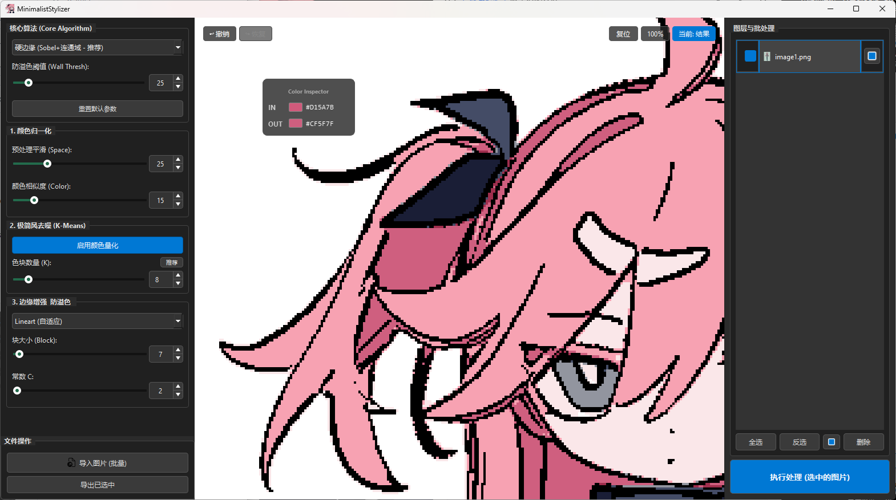

# Minimalist Stylizer (极简风格化工具)

<div align="center">


**A Python desktop tool that transforms images into minimalist vector-style illustrations using OpenCV and PyQt6 (AI-assisted development with Gemini).**

采用**硬边缘检测 (Hard Edge)** 与**连通域填色**算法，模拟 HTML Canvas 的像素处理逻辑，有效解决传统色阶分离带来的噪点和溢色问题，实现干净、锐利的色块化效果。

[📥 下载可执行文件 (Releases)](https://github.com/Enosensu/MinimalistStylizer/releases) | [💻 查看源码](https://github.com/Enosensu/MinimalistStylizer?tab=readme-ov-file#%E2%80%8D-开发安装与运行-development)

<br>

<br>

</div>

---

## 🖼️ 效果演示 (Demo)

| Processing Flow | Adjustment Curve |
|:---:|:---:|
|  |  |

## ✨ 核心功能 (Features)

- **🎨 硬边缘算法 (Hard Edge)**：核心独家算法。基于 Sobel 梯度筑墙 + 形态学闭运算 + 连通域分析，实现物理级防溢色，色块边缘锐利清晰，告别“脏”色块。
- **🔢 极简风去噪 (K-Means)**：内置基于 K-Means 聚类的全局颜色量化，支持直方图分析，一键推荐保留 95% 色彩信息的最佳 K 值。
- **🛠️ 多模式工作流**：
  - **核心算法**：除硬边缘外，亦支持双边滤波 (Bilateral) 和均值漂移 (MeanShift) 以适应不同画风。
  - **显示模式**：支持一键在“叠加预览”、“纯色块结果”、“仅描边线稿”之间循环切换。
- **✒️ 智能描边系统**：支持 Sobel、Canny、自适应阈值 (Lineart) 三种检测模式。描边层与色块层解耦，支持**导出透明背景的纯线稿 PNG**。
- **⚡ 高效交互**：
  - **图层管理**：支持多图批量导入、批量参数调整、批量导出。
  - **历史记录**：支持无限撤销/恢复 (Undo/Redo)。
  - **细节查看**：画布支持滚轮缩放、拖拽，配备实时悬浮吸管查看原图/结果颜色对比。

## 👨‍💻 开发安装与运行 (Development)

确保你的电脑上安装了 Python 3.9 或更高版本。

### 1. 克隆仓库
```bash
git clone https://github.com/Enosensu/MinimalistStylizer.git
cd MinimalistStylizer
```

### 2. 创建虚拟环境 (推荐)
```bash
# Windows (如果遇到权限错误，请以管理员运行 PowerShell 并输入: Set-ExecutionPolicy RemoteSigned)
python -m venv venv
.\venv\Scripts\activate

# macOS/Linux
python3 -m venv venv
source venv/bin/activate
```

### 3. 安装依赖
```bash
# (可选) 升级 pip 以避免安装错误
python -m pip install --upgrade pip

pip install -r requirements.txt
```

### 4. 运行程序
```bash
python main.py
```

## 📖 使用指南 (Usage)

1.  **导入**：点击左下角 “**导入图片**” 或直接将图片拖拽进入窗口。
2.  **参数调节**：
    * **核心算法**：推荐保持默认的 “**硬边缘**”。
    * **防溢色阈值**：控制色块的闭合程度。值越小细节越多（墙壁越密），值越大色块越整洁但可能溢色。
    * **K-Means**：点击 “**推荐**” 按钮获取最佳 K 值，或手动滑动调整颜色数量。
3.  **预览与对比**：鼠标在画布上移动可查看像素颜色；右上角按钮可切换原图/结果视图。
4.  **导出**：
    * 在右侧列表中勾选需要导出的图片。
    * 点击 “**导出已选中**”。
    * *注：如果在列表中将模式切换为“仅描边”，导出的将是透明背景的线条图。*

## 📜 开源协议 (License)

本项目基于 [MIT License](LICENSE) 开源。这意味着您可以自由地使用、修改和分发本项目，包括用于商业用途，只需保留原作者的版权声明即可。

## 🙏 致谢 (Acknowledgments)

感谢 **Google Gemini** 提供的对话式开发辅助，助力项目需求梳理与代码迭代。

本项目核心功能基于 [OpenCV](https://opencv.org/) 和 [PyQt6](https://www.riverbankcomputing.com/software/pyqt/) 等优秀的开源库实现。
